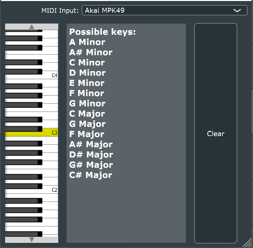
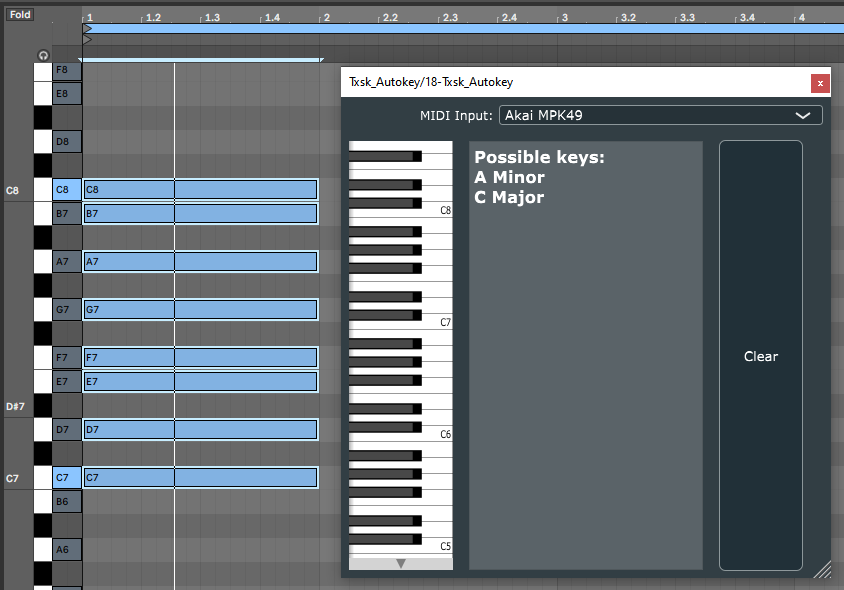

# AutoKeyVST

Using either MIDI input from a Digital Audio Workstation, or as a standalone application with a MIDI input device you can detect which keys the notes you input fall under. Very helpful for both beginner music producers as well as advanced producers who have minimal music theory education.

